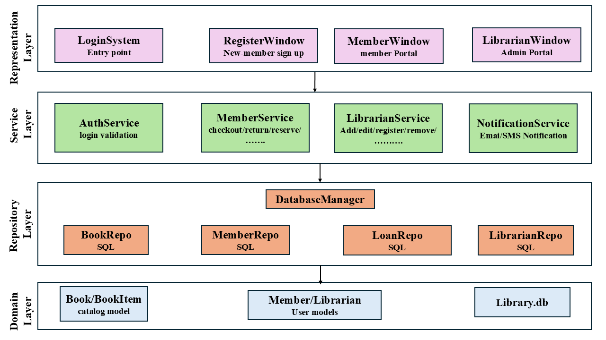
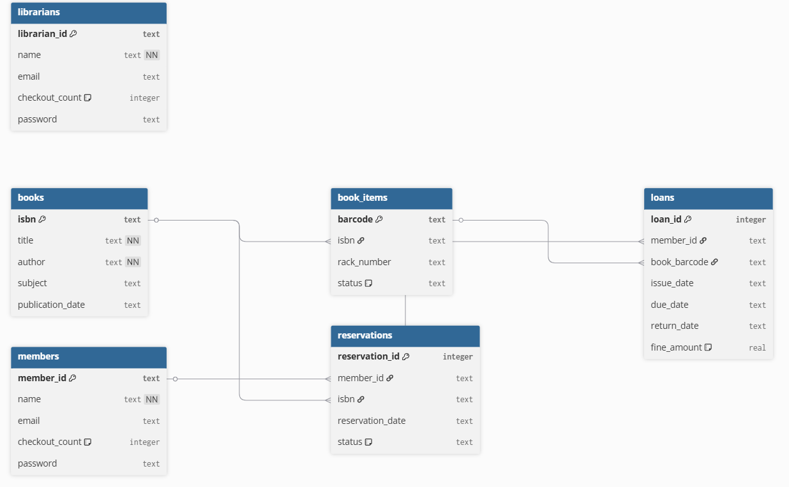
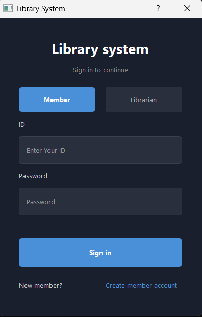
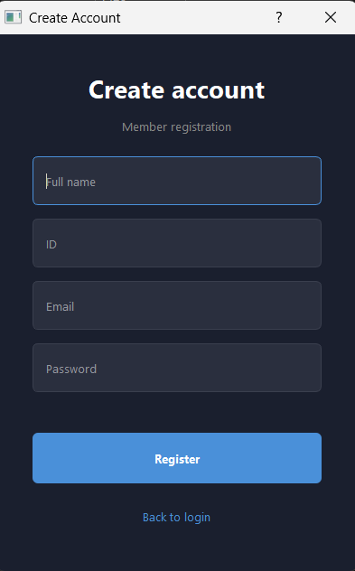
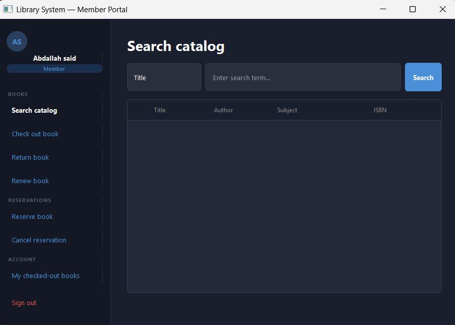
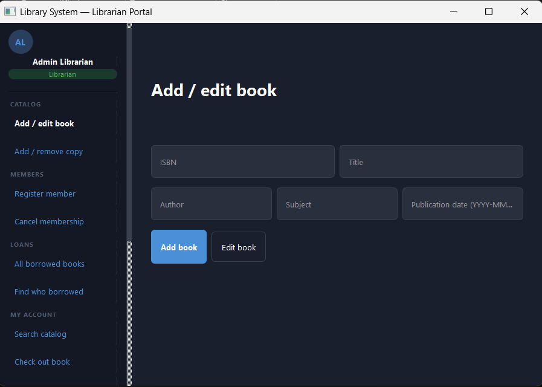
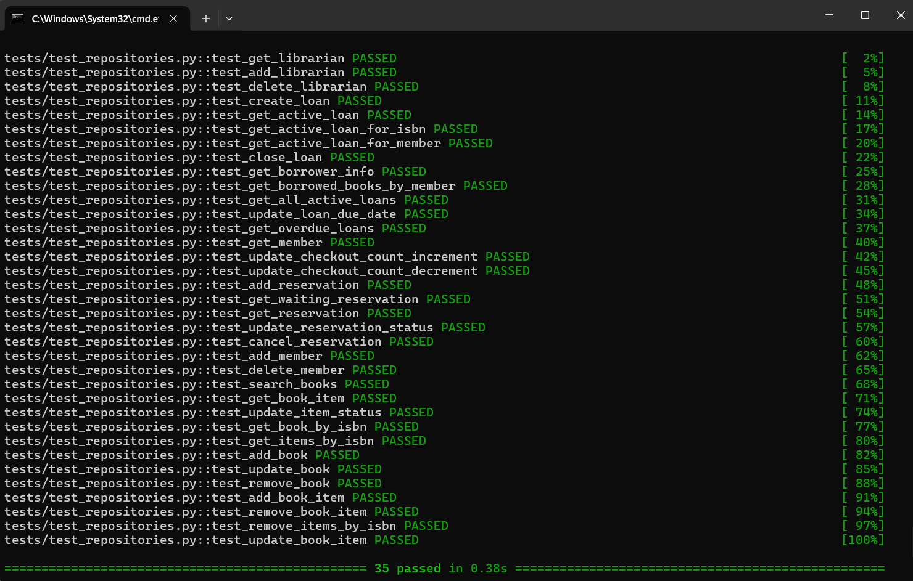

# Library Management System

> A robust, layered desktop application for managing library assets, user accounts, loans, and reservations.
---

## Architecture & Design Decisions

The core codebase is organized into **N-Tier Layered Architecture**. Each layer depends only on the layer below it, keeping higher-level code testable, maintainable, and strictly decoupled from the database


| Layer                              | Description                                                                                                                                              |
|------------------------------------|----------------------------------------------------------------------------------------------------------------------------------------------------------|
| **Presentation Layer (UI)**        | PyQt5 interfaces (*_window.py). Responsible only for capturing user input and displaying data. Contains zero business logic or database knowledge.       |
| **Service Layer**                  | Orchestrates business rules (e.g., fine calculation, checkout limits, validation). Manages the lifecycle of database connections using Context Managers. |
| **Data Access Layer (Repository)** | Isolates all SQL queries. Each domain entity has a dedicated repository (e.g., BookRepository, LoanRepository).                                          |
| **Domain Layer**                   | Pure Python objects (Book, Member, Librarian) representing business entities. Contains zero database imports.                                            |

| Design Decision               | Implementation                                                                                                                                                                  |
|-------------------------------|---------------------------------------------------------------------------------------------------------------------------------------------------------------------------------|
| **Dependency Injection (DI)** | Database connections are created in the Service layer and injected into Repository constructors. This eliminates hardcoded dependencies and makes the system highly modular.    |
| **Context Manager**           | The `DatabaseManager` implements `__enter__` / `__exit__` magic methods ensuring database connections are safely opened and closed automatically, prevents resources leaks      |
| **Standard Library Only**     | The entire backend relies only on Python's `stdlib` (`sqlite3`, `datetime`, `abc`) the only external dependency (`PyQt5`) is strictly confined to the Presentation Layer        |
| **Factory Pattern**           | Domain objects use `@classmethod` factories (`from_db_row`) to construct rich objects safely from raw DB tuples — no fragile magic indexes (Note: used for Domain objects only) |

## OOP Concepts Applied

| Concept           | Where                                                                                                       |
|-------------------|-------------------------------------------------------------------------------------------------------------|
| **Inheritance**   | `Librarian` extends `Member` — reuses checkout, return, and fine logic                                      |
| **Polymorphism**  | `Librarian` objects passed directly into `MemberService` with no type checks                                |
| **Encapsulation** | SQL is never exposed outside repository classes; services interact with domain objects only                 |
| **Abstraction**   | Service methods hide all implementation details — callers only see `checkout_book()`, not the SQL behind it |


---
# Database Schema

The application stores all its data in a single SQLite database file called `library.db`, which contains six tables. When the application starts, it automatically checks if these tables exist and creates them if they don’t. This setup is handled by the `DatabaseManager`. The process is safe to run every time the app starts, because it won’t recreate or overwrite tables that already exist.


## Tables
### books
- purpose: Book catalog entities
- primary key: isbn

| Column           | Type | Constraints | Description            |
|------------------|------|-------------|------------------------|
| isbn             | TEXT | PRIMARY KEY | Unique book identifier |
| title            | TEXT | NOT NULL    | Title of the book      | 
| author           | TEXT | NOT NULL    | Author of the book     | 
| subject          | TEXT |             | Category               | 
| publication_date | TEXT |             | Publication date       | 


### book_items
- purpose: represents physical copies of a book
- primary key: barcode

| Column  | Type | Constraints               | Description                     |
|---------|------|---------------------------|---------------------------------|
| barcode | TEXT | PRIMARY KEY               | Unique physical copy identifier |
| isbn    | TEXT | FOREIGN KEY ➝ books(isbn) | Which book this copy belongs to | 
| rack    | TEXT |                           | physical location               | 
| statue  | TEXT | DEFAULT `available`       | available, loaned, damaged      | 

### members
- purpose: stores library members (and inherits behaviour to librarians)
- primary key: member_id

| Column         | Type    | Constraints | Description                         |
|----------------|---------|-------------|-------------------------------------|
| member_id      | TEXT    | PRIMARY KEY | Unique member identifier            |
| name           | TEXT    | NOT NULL    | Full name                           | 
| email          | TEXT    |             | Contact Email                       | 
| checkout_count | INTEGER | DEFAULT `0` | Current number of books checked out |
| password       | TEXT    |             | Account Password                    | 

### librarians
- purpose: stores librarian staff (inherits member capabilities)
- primary key: librarian_id

| Column         | Type    | Constraints | Description                         |
|----------------|---------|-------------|-------------------------------------|
| librarian_id   | TEXT    | PRIMARY KEY | Unique librarian identifier         |
| name           | TEXT    | NOT NULL    | Full name                           | 
| email          | TEXT    |             | Contact Email                       | 
| checkout_count | INTEGER | DEFAULT `0` | Current number of books checked out |
| password       | TEXT    |             | Account Password                    |

### loans
- purpose: tracks which member has which physical copy
- primary key: loan_id (Automatically)

| Column       | Type    | Constraints                       | Description                   |
|--------------|---------|-----------------------------------|-------------------------------|
| loan_id      | INTEGER | PRIMARY KEY AUTOINCREMENT         | Unique transaction identifier |
| member_id    | TEXT    | FOREIGN KEY ➝ members(member_id)  | Who borrowed it               | 
| book_barcode | TEXT    | FOREIGN KEY ➝ book_items(barcode) | which physical copy           | 
| issue_date   | INTEGER | DEFAULT `0`                       | When it was checked out       |
| due_date     | TEXT    |                                   | When it must be returned      |
| return_date  | TEXT    |                                   | NULL if currently borrowed    |
| fine_amount  | REAL    | DEFAULT `0.0`                     | Fine calculated upon return   |

### Reservations
- purpose: tracks queue for books that are currently checked out
- primary key: reservation_id (Automatically)

| Column           | Type    | Constraints                      | Description                   |
|------------------|---------|----------------------------------|-------------------------------|
| reservation_id   | INTEGER | PRIMARY KEY AUTOINCREMENT        | Unique reservation identifier |
| member_id        | TEXT    | FOREIGN KEY ➝ members(member_id) | Who wants the book            | 
| isbn             | TEXT    | FOREIGN KEY ➝ books(isbn)        | which book they want          | 
| reservation_date | TEXT    |                                  | When the request was made     |
| statue           | TEXT    | DEFAULT `waiting`                | waiting, notified, cancelled  |

---
##  Features

### Member Portal
- Search the catalog by **Title**, **Author**, **Subject**, or **Publication Date**
- **Check out**, **return**, and **renew** books
- **Reserve** unavailable books — automatically notified when returned
- View currently checked-out books (for himself) and **fine calculations**

### Librarian Portal
- Full member capabilities (librarians can check out books for themselves)
- **Catalog management** — add/edit books, manage physical copies, barcodes, and rack numbers
- **User management** — register or delete members and librarians
- **System reporting** — view all active loans, find specific borrowers, run overdue checks

---

## Project Structure

```
Library-Management-System/
|--- main.py                     #  Automated test scenario and Interactive mode
|--- app.py                      # Application entry point
|--- database.py                 # Infrastructure: DB connection & Context Manager
|
|--- models/                     # Domain Layer
|   |--- person.py                   # Member & Librarian entities
|   |--- book.py                     # Book & BookItem entities

|--- repositories/               # Data Access Layer — pure SQL execution
|   |--- book_repository.py
|   |--- loan_repository.py
|   |--- member_repository.py
|   |--- librarian_repository.py
|
|--- services/                   # Business Logic Layer — rules & orchestration
|   |--- auth_service.py
|   |--- member_service.py
|   |--- librarian_service.py
|   |--- notification_service.py
|
|--- UI/                         # Presentation Layer — PyQt5 .ui files
|   |--- login.ui
|   |--- member_portal.ui
|   |--- librarian_portal.ui
|   |--- *_window.py            # UI Logic — connects services to .ui files
|   |--- styles.py              # Theme & styling variables
|
|--- tests/                     # Automated Test Suite
    |--- test_repositories.py
```

---
## UI
### Dynamic UI Messaging
Because the service layer returns boolean values and prints to stdout (supporting both CLI and GUI), the PyQt5 windows use `io.StringIO` to **capture standard output dynamically** and display it as colored success/error messages in the UI — keeping the UI fully decoupled from backend string formatting.

 PyQt5 interfaces
### Login window:
 

### register window:


### Member window:


### Librarian window:


## Setup & Installation

### Prerequisites
- Python **3.8+**

### Step 1 — Clone the Repository
```bash
git clone <https://github.com/abdallahsaid104/Library-Management-System>
cd Library-Management-System
```

### Step 2 — Create & Activate a Virtual Environment
Recommended to avoid conflicts with other packages on your system.

**macOS / Linux:**
```bash
python3 -m venv venv
source venv/bin/activate
```

**Windows:**
```bash
python -m venv venv
venv\Scripts\activate
```

### Step 3 — Install Dependencies
Once your virtual environment is active (you'll see `(venv)` in your terminal):

```bash
pip install PyQt5 pytest pytest-mock

# Or with uv (faster)
uv pip install PyQt5 pytest pytest-mock
```

### Step 4 — Run the Application
The app will automatically generate `library.db` and seed it with dummy data on the first run.

```bash
python app.py
# Or (If using uv)
uv run main.py    # For interactive mode
uv run app.py     # GUI
```

### Step 5 — Run the Automated Tests
Thanks to Dependency Injection, tests run in milliseconds with no live database required.

```bash
pytest tests/test_repository.py -v
# or (if using uv)
uv run pytest tests/test_repositories.py -v
```

---


